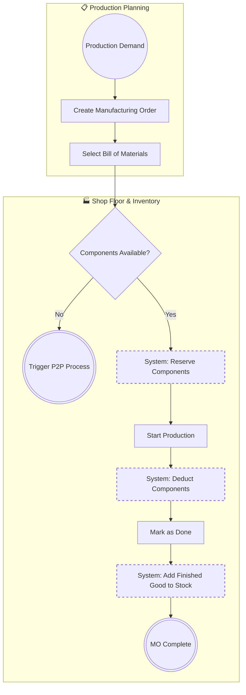
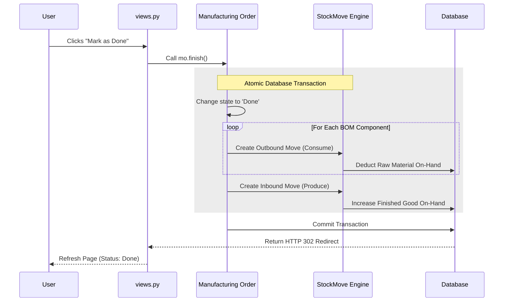

# Make-to-Stock (MRP) Architecture

This document outlines the Manufacturing Resource Planning (MRP) process within NexusERP, demonstrating the integration between Production Planning and Shop Floor Inventory Management.

## 1. Macro Process (Level 1: General Flow)
The macro process maps the lifecycle of a Manufacturing Order (MO). It demonstrates how raw materials are staged, consumed, and converted into finished goods.

### Process Description:
1. **Planning:** Production demand triggers the creation of a Manufacturing Order. A specific Bill of Materials (BOM) is linked to the order.
2. **Component Validation:** The system evaluates current warehouse stock against the BOM requirements. If materials are short, procurement is triggered.
3. **Reservation & Production:** If stock is available, it is hard-reserved. Production begins, locking the components.
4. **Completion:** When the user marks the MO as 'Done', the system simultaneously deducts the consumed raw materials and adds the finished good to available inventory.

### Macro Flowchart (Mermaid)

2. Micro Process (Level 2: Inventory Transaction Engine)

This micro-process details the exact system logic that executes during the `Mark as Done` step in the Manufacturing swimlane. It demonstrates the engine's ability to handle multi-line inventory transactions atomically.

### Process Description:
When an MO is completed, the system must execute multiple inventory adjustments simultaneously. If one component fails to deduct, the entire production run must roll back to prevent ghost inventory.
1. The `mo.finish()` method is called.
2. A Database Transaction `(transaction.atomic)` is opened.
3. The engine iterates through every component listed in the BOM.
4. For each component, a negative `StockMove` is generated, deducting the raw material from the warehouse.
5. Finally, a positive `StockMove` is generated, adding the finished good to the warehouse.
6. The database transaction commits all moves simultaneously.

### Micro System Sequence (Mermaid)
