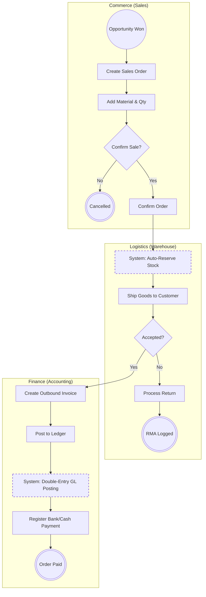
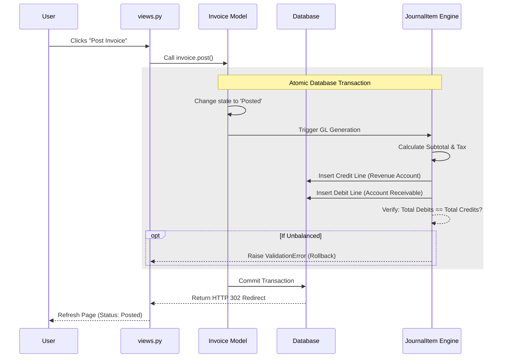

# Order-to-Cash (O2C) Architecture

This document outlines the standard Order-to-Cash process within NexusERP, demonstrating the integration between Commerce (CRM/Sales), Logistics (Inventory), and Finance (Accounting).

## 1. Macro Process (Level 1: General Flow)
The macro process maps the user journey from an Opportunity to a Paid Invoice. It features cross-module boundaries and conditional logic for order fulfillment.

### Process Description:
1. **Commerce:** The cycle begins when an Opportunity is won. A Sales Order is drafted and lines are added.
2. **Logistics Hand-off:** Upon order confirmation, the system automatically checks `on_hand` inventory and reserves the required stock.
3. **Fulfillment:** Warehouse staff ship the goods. If rejected, an RMA (Return) is processed.
4. **Finance Hand-off:** Once delivered, Finance drafts an Outbound Invoice.
5. **Accounting:** Posting the invoice triggers the core GL engine, and the cycle ends when the payment is registered.

### Macro Flowchart (Mermaid)

## 2. Micro Process (Level 2: Automated GL Posting)
This micro-process details the exact system logic that executes during the Post to Ledger step in the Finance swimlane. It demonstrates the transactional integrity of the Double-Entry Accounting engine.

### Process Description:
When a user clicks "Post Invoice," the system must guarantee that Debits equal Credits before committing to the PostgreSQL database.
1. The `invoice.post()` method is called.
2. A Database Transaction `transaction.atomic` is opened to prevent partial data writes if a failure occurs.
3. The system queries the `financial_reports` logic to identify the correct Revenue (Credit) and Accounts Receivable (Debit) accounts.
4. The engine verifies `Total Debits == Total Credits`.
5. If unbalanced, a `ValidationError` triggers a rollback. If balanced, the commit succeeds.

### Micro System Sequence (Mermaid)
