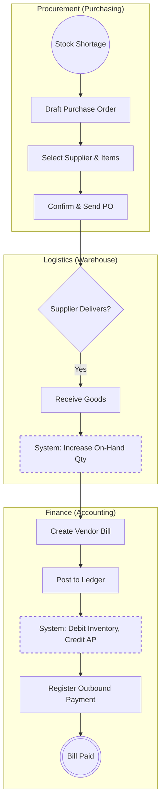

# Procure-to-Pay (P2P) & Replenishment Architecture

This document outlines the standard Procure-to-Pay process within NexusERP, highlighting the integration between Procurement, Logistics, and Finance, as well as the automated predictive reordering engine.

## 1. Macro Process (Level 1: General Flow)
The macro process maps the lifecycle of purchasing external inventory. It demonstrates how goods receipts trigger financial liabilities.

### Process Description:
1. **Procurement:** A stock shortage is detected (either manually or via automation). A Purchase Order is drafted, confirmed, and sent to the supplier.
2. **Logistics Hand-off:** The warehouse awaits delivery. Upon receipt, the system dynamically updates the `on_hand` inventory valuation.
3. **Finance Hand-off:** Finance converts the receipt into a Vendor Bill (Inbound Invoice).
4. **Accounting:** Posting the bill triggers the Double-Entry GL engine (Debit Inventory, Credit Accounts Payable). The cycle concludes when an outbound payment is registered.

### Macro Flowchart (Mermaid)


## 2. Micro Process (Level 2: Automated Replenishment Engine)
This micro-process details the predictive AI/churn-rate background job inside the `apps/automation` module. It demonstrates the ability to write headless background scripts that run independently of the web UI.

### Process Description:
A CRON job executes nightly to evaluate inventory health and prevent stockouts.
1. The database is queried for all materials flagged for `auto_reorder`.
2. The engine calculates the historical daily churn rate for each material.
3. It projects demand over a 30-day window. If projected demand exceeds current `on_hand` stock, a reorder event is triggered.
4. The system automatically generates draft Purchase Order lines and groups them by the assigned primary supplier.

### Micro System Flowchart (Mermaid)
```mermaid
flowchart TD
    classDef db shape:cylinder;
    classDef logic stroke-width:2px,stroke-dasharray: 5 5;

    Start((Midnight CRON Job)) --> QueryDB[(Query Materials DB)]:::db
    QueryDB --> Filter[Filter: auto_reorder = True]
    
    Filter --> Loop[For Each Material]
    Loop --> Calc[Calculate Daily Churn Rate]:::logic
    Calc --> Forecast[Project 30-Day Demand]:::logic
    Forecast --> Check{Proj Demand > On-Hand?}
    
    Check -- No --> Skip[Skip Item]
    Check -- Yes --> GenPO[Generate Draft PO Line]:::logic
    
    Skip --> NextLoop{More Items?}
    GenPO --> NextLoop
    
    NextLoop -- Yes --> Loop
    NextLoop -- No --> GroupPO[Group Lines by Supplier]:::logic
    GroupPO --> SaveDB[(Save to PO Database)]:::db
    SaveDB --> End(((Process Sleep)))
    ```