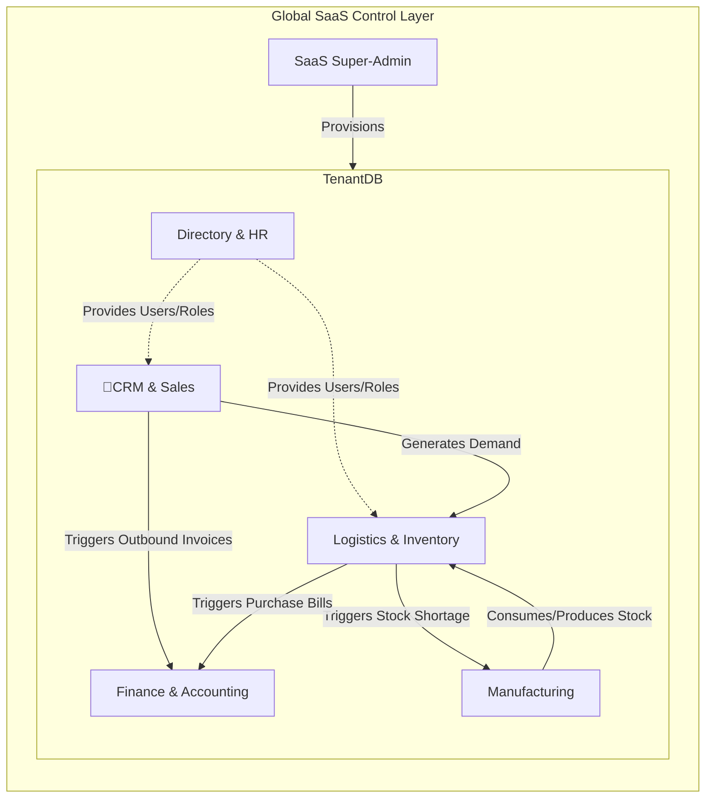
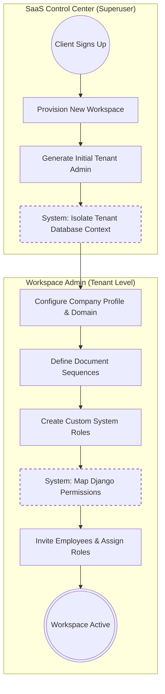
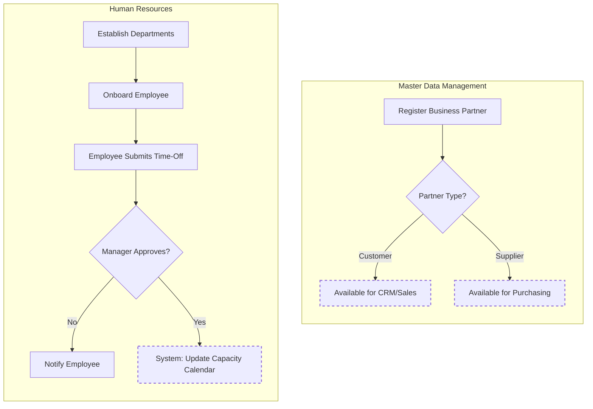

# NexusERP: Master System Map & Module Architecture

This document provides the Level 0 and Level 1 architectural mapping of the NexusERP platform. It illustrates how the multi-tenant SaaS layer controls access, how the major operational modules interact, and how foundational master data is managed.

## 1. Level 0: Master Module Interaction Map
This diagram illustrates the macro-level data flow across the entire ERP platform. It shows how a business event in the CRM triggers a cascade of automated actions through the Supply Chain, Manufacturing, and ultimately ends in the Finance General Ledger.

## 2. SaaS Provisioning & Access Control (Administrative Flow)
This process maps the strict boundary between Global SaaS Administrators and Workspace Tenant Administrators. It demonstrates the RBAC (Role-Based Access Control) lifecycle.

### Process Description:
1. Global SaaS: The system owner provisions a new Workspace and creates an initial Tenant Admin.
2. enant Configuration: The Tenant Admin logs into their isolated workspace and configures company profiles and document sequences.
3. RBAC: The Tenant Admin creates granular roles (mapping directly to Django permissions).
4. Onboarding: The Tenant Admin invites employees, assigns roles, and grants system access.

## 3. Master Data & Human Resources Flow
This maps the foundational directory processes required before transactional operations (like sales or manufacturing) can occur.

### Process Description:
1. Partner Directory: Customers and Suppliers must be registered before Commerce and Logistics can operate.
2. HR Organization: Departments are established, and Employees are mapped to those departments.
3. Time-Off Management: Employees submit leave requests which route to managers for approval, impacting operational capacity.

### 4. Transactional Engines
For detailed, system-level documentation of the core operational engines, please refer to the following architectural mappings:
## . [Order-to-Cash (O2C) & GL Engine](docs/O2C_ARCHITECTURE.md): Details the sales pipeline, stock reservation, and double-entry accounting execution.
## . [Procure-to-Pay (P2P) & AI Replenishment](docs/P2P_ARCHITECTURE.md): Details the purchasing lifecycle and the automated background CRON worker.
## . [Make-to-Stock (MRP)](docs/MRP_ARCHITECTURE.md):Details the Bill of Materials expansion and atomic multi-stage inventory transactions. Details the Bill of Materials expansion and atomic multi-stage inventory transactions.
